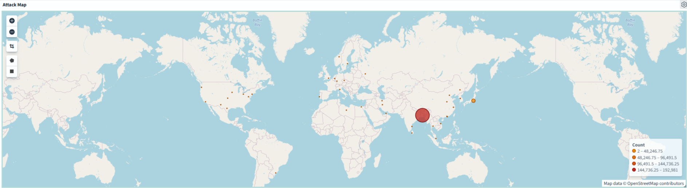

# AWS SSH Honeypot — Threat Intelligence Pipeline

A self-hosted SSH honeypot deployed on AWS that captured **205,620 real attack events** over one week, then processed and visualized them through a Logstash → OpenSearch pipeline with GeoIP enrichment.

This project demonstrates an end-to-end security data workflow: deploying an exposed-but-isolated sensor, collecting live attacker traffic, building an ETL pipeline off the sensor, and turning raw logs into an analyst-ready dashboard.



---

## What this project shows

- Deploying and **hardening** an intentionally internet-exposed host on AWS (custom VPC, restricted security groups, non-standard SSH port, locked-down egress)
- Building a **log-processing pipeline** that ships data *off* the sensor to a separate processing tier — the way a real SOC keeps its tooling off the compromised asset
- **GeoIP enrichment** and correct `geo_point` mapping in OpenSearch to power a geographic attack map
- Turning 205K raw events into **defensible findings** by validating the data instead of trusting the first chart

---

## Architecture

```
   Internet (attackers)
          │
          ▼
┌───────────────────────┐      cowrie.json       ┌────────────────────────┐
│   Honeypot (Cowrie)   │  ───────────────────▶  │  Processor (Logstash)  │
│   EC2 t3.micro        │     scp, off-host      │  EC2 c7i-flex.large    │
│   Custom VPC, hardened│                        │  Parse + GeoIP enrich  │
└───────────────────────┘                        └───────────┬────────────┘
                                                             │ HTTPS bulk
                                                             ▼
                                              ┌────────────────────────────┐
                                              │   Amazon OpenSearch         │
                                              │   t3.small.search           │
                                              │   geo_point mapping         │
                                              │   Dashboards (4 visuals)    │
                                              └────────────────────────────┘
```

**Design choice:** the Logstash processor runs on a *separate, isolated* instance, not on the honeypot itself. A honeypot is a deliberately exposed asset; running log processing on it would both contradict that isolation and risk the OOM-killer taking down the collector. Shipping logs to a dedicated processing tier mirrors real SOC architecture.

---

## Stack

| Layer | Technology |
|---|---|
| Honeypot | [Cowrie](https://github.com/cowrie/cowrie) SSH/Telnet honeypot |
| Compute | AWS EC2 (Ubuntu 24.04) |
| Network | Custom VPC, security groups, Elastic IP |
| Pipeline | Logstash 8.x + `logstash-output-opensearch` + GeoIP filter |
| Storage / Search | Amazon OpenSearch Service |
| Visualization | OpenSearch Dashboards |

---

## Key findings

Over **7 days**, the honeypot recorded **205,620 events**.

### 1. Traffic was dominated by two automated sources

Two IP addresses accounted for **~94% of all traffic**:

| Source IP | Events | Share |
|---|---|---|
| `118.179.155.139` | 102,451 | ~50% |
| `103.252.127.250` | 90,515 | ~44% |

Both correspond directly to the two large spikes in the activity timeline (Jun 19 and Jun 23) — sustained automated campaigns rather than scattered scanning.

### 2. The events are full intrusion sessions, not just scans

Event types are evenly distributed across the SSH session lifecycle (~25,500 each):

```
cowrie.session.connect    25,922
cowrie.session.closed     25,922
cowrie.client.version     25,781
cowrie.client.kex         25,721
cowrie.command.input      25,568
cowrie.login.success      25,522
cowrie.login.failed           68
```

`login.success` (25,522) vastly outnumbering `login.failed` (68) reflects Cowrie's design — it accepts most credentials to observe post-access behavior. The real value is in **what attackers did after getting in**.

### 3. The top command is a known botnet fingerprint

| Command | Count |
|---|---|
| `echo -e "\x6F\x6B"` | 25,457 |
| `uname -a` | 17 |
| `cat /proc/uptime ...` | 8 |
| `... /proc/meminfo MemTotal ...` | 8 |

`\x6F\x6B` is hex for **"ok"** — automated bots run this immediately after gaining a shell to confirm command execution works before deploying a payload. The follow-up commands (`uname -a`, `/proc/uptime`, `/proc/meminfo`) are **hardware reconnaissance** — the bot checks CPU, memory, and uptime to decide whether the host is worth infecting.

**The captured playbook:** gain shell → confirm with `ok` → fingerprint hardware → decide.

> Note on data integrity: 5 of the ~25,500 command events originated from my own IP during setup verification (a test `wget` and `echo SHELL_TEST`). At 0.002% of the dataset they don't affect any finding, but they're disclosed here for transparency.

---

## The pipeline

The core artifact is the Logstash config that parses Cowrie's JSON, enriches each source IP with GeoIP, and bulk-loads into OpenSearch. See [`pipeline/cowrie.conf`](pipeline/cowrie.conf).

GeoIP coordinates only render on a map if the target field is mapped as a `geo_point` **before** indexing. That requires an index template applied ahead of the write — see [`pipeline/opensearch-geo-template.json`](pipeline/opensearch-geo-template.json).

---

## Challenges & lessons

Real debugging from the build — included because diagnosing these is the actual skill:

- **`geo_point` mapping:** GeoIP coordinates imported as plain numbers and the map wouldn't plot them. Fix was an OpenSearch **index template** defining `geoip.geo.location` as `geo_point`, applied *before* indexing, with the index name matching the template pattern.
- **ECS field naming:** Logstash's ECS-compatibility mode nested geo fields under `geoip.geo.location.{lat,lon}` rather than the classic flat names — the template had to target the actual path.
- **Duplicate ingestion:** a missing hyphen in the output index name (`cowrie-geo%{...}` vs `cowrie-geo-%{...}`) sent re-runs into the wrong index, quadrupling the document count. Caught by noticing the count was exactly 4× the source file's line count.
- **Logstash `sincedb`:** the file input tracks read position and won't re-read a "finished" file; clearing the registry was required to re-ingest.

Lesson: **validate document counts against the source** and **inspect field mappings** before trusting a visualization.

---

## Reproducing

> This deploys an intentionally internet-exposed host. Run it in an isolated account, harden it, and tear it down when finished. You are responsible for what runs in your AWS account.

High level:
1. Deploy Cowrie on a hardened EC2 instance in an isolated VPC.
2. Collect for 1–2 weeks.
3. Stand up a separate processor instance with Logstash + `logstash-output-opensearch`.
4. Apply the `geo_point` index template, then run the pipeline (`pipeline/cowrie.conf`).
5. Build an index pattern + visualizations in OpenSearch Dashboards.
6. **Tear everything down** (delete the OpenSearch domain, terminate instances, release the Elastic IP).

---

## Repo contents

```
├── dashboard/        Dashboard screenshots + exported saved objects
├── pipeline/         Logstash config + OpenSearch geo_point template
├── analysis/         Deeper findings writeup
├── architecture/     Architecture diagram
└── README.md
```

---

*Built as a hands-on cloud-security project. Feedback welcome.*
